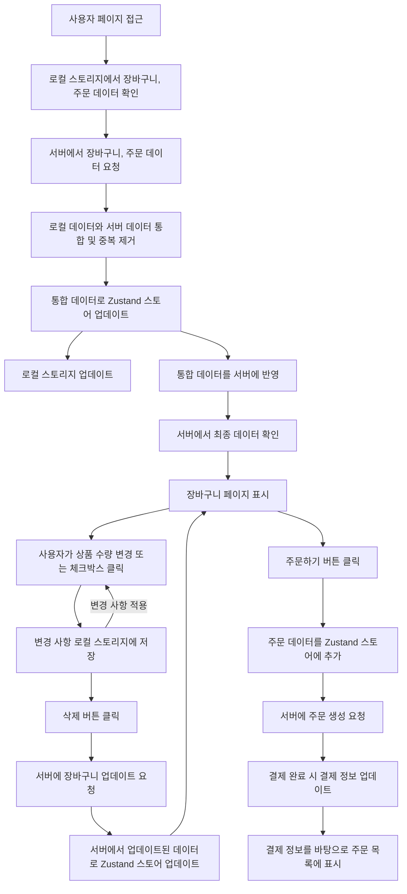

   

<h2 align="middle">NEXTSTEP 장바구니 미션</h2>

 

### 👀 [배포 URL](https://react-shopping-cart-payments-five.vercel.app)

> [NEXTSTE TDD, 클린 코드 with React 3기](https://edu.nextstep.camp/c/QoTvUh4y) 에서 진행한 장바구니 미션입니다.

일상생활에서 쉽게 접할 수 있는 식재료를 구매할 수 있는 쇼핑몰입니다. 
사용자들이 원하는 식재료를 손쉽게 장바구니에 담고, 안전하게 결제할 수 있도록 설계했습니다.

 

### 🛠️ 기술 스택

  

### 📈 상태 플로우 다이어그램

