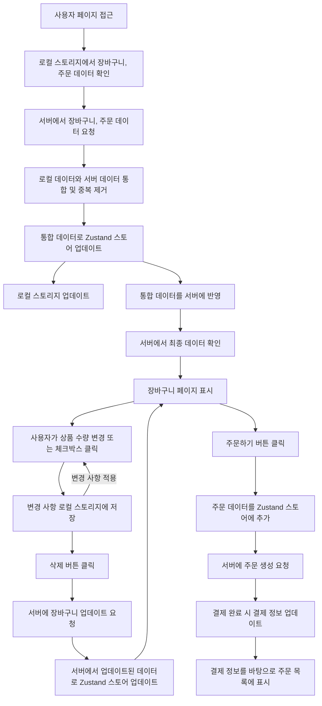

   

<h2 align="middle">NEXTSTEP 장바구니 미션</h2>

 

### 👀 [배포 URL](https://react-shopping-cart-payments-five.vercel.app)

> [NEXTSTE TDD, 클린 코드 with React 3기](https://edu.nextstep.camp/c/QoTvUh4y) 에서 진행한 장바구니 미션입니다.

## 💭 소개

> 일상 속에서 필요한 식재료를 손쉽게 구매할 수 있는 쇼핑몰입니다. 
> 원하는 식재료를 손쉽게 장바구니에 담아 안전하게 결제할 수 있어요.

 

## 🛠️ 기술 스택

  

## ✨ 기능 및 구현사항

**0. 주요 기술 및 상태 관리 전략**

- TanStack Query를 기반으로 상태분리
- MSW를 활용한 API mocking
- UI 변경이 일어나는 곳에 낙관적 업데이트를 활용하여 UI/UX 증진
- 반응형 레이아웃 구현
   

   
<strong>Query Caching 전략</strong>

    

  1.  **상품 정보**

      데이터: products, productDetail

  - 판매자에 의해 변경 시 업데이트되지만, 상품 목록이 자주 변경되지 않으므로, staleTime을 설정할 수 있음.
    - staleTime: 5분
  - 사용자가 자주 접근하는 데이터이므로 캐시에 오래 유지되어야 함
    - gTcime: 30분

  2.  **장바구니 정보**

      데이터: cartProducts

  - 사용자에 의해 자주 변경되고, 실시간 업데이트해줘야 함
    - 항상 fresh한 상태 유지 → staleTime: 0
  - 장바구니 세션에만 유의미하다.
    - gcTime: 기본값

  3.  **주문 정보**

      데이터: orders, orderDetails

  - 사용자 주문 시 업데이트 됨, 주문 정보의 경우 확정된 이후에 변경되지 않음.
    - staleTime을 하루 정도로 둠.
  - 주문 정보의 경우 사용자가 주문 내역 확인 시 조회함으로 오래 유지되어야 함.
    - gcTime 또한 하루 정도

   

**1. 상품 목록 (메인 화면)**

- **상품들의 정보(사진, 상품명, 상품)들 볼 수 있습니다.**
- 장바구니 버튼 클릭하면, 해당 상품이 장바구니 담기고, 장바구니 이동 선택 모달
- 무한스크롤을 적용하고 뒤로가기 및 페이지 전환시 기존 페이지 스크롤 위치 기억
- 상품 상세 보기, 장바구니 기능

**2. 장바구니**

- **장바구니에 담긴 상품의 정보, 결제 예상 금액을 확인할 수 있습니다.**
- 상품의 수량 변경 가능(최소 수량: 1, 최대 수량 : 20)
- 상품의 체크 유무에 따라 상품의 총 금액과 결제 예상 금액도 변경
- 상품 삭제 버튼 클릭 시 확인 메세지가 보여짐
- 주문하기 버튼 클릭 시, 체크된 상품들은 데이터베이스에서 제거

**3. 주문 목록**

- **주문한 상품의 목록, 주문 정보를 볼 수 있습니다.**
- 주문 상세 보기 기능

 

## 📈 상태 플로우 다이어그램

